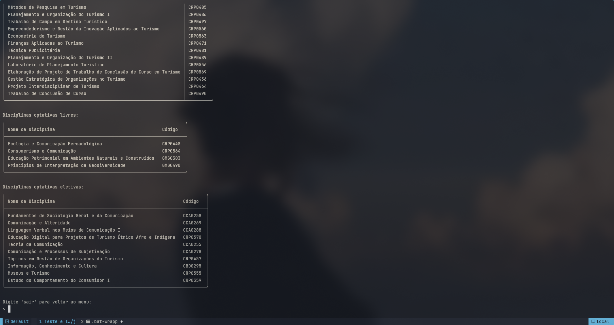

# Jupiter Scrapper



Um web scrapper para buscar ou listar informações sobre cursos oferecidos pela
Universidade de São Paulo (USP) por meio do sistema online
[Jupiter](https://uspdigital.usp.br/jupiterweb/jupCarreira.jsp?codmnu=8275).

<!--toc:start-->

- [Instruções de uso](#instruções-de-uso)
  - [Usando `nix`](#usando-nix)
  - [Usando `pip`](#usando-pip)
  - [Usando `poetry`](#usando-poetry)
- [Changelog](#changelog)
- [Autores](#autores)
  <!--toc:end-->

## Instruções de uso

Siga uma das seguintes instruções para instalar a todas as dependências e
executar o programa.

### Usando nix

Tendo instalado o gerenciador de pacotes `nix` com
[flakes habilitados](https://nixos.wiki/wiki/flakes), em seu terminal acesse a
pasta raiz do projeto e execute:

```bash
nix run
```

Para instalar a todas as dependências e executar o programa em um ambiente shell
isolado e temporário.

Para limitar o número de unidades da USP sendo pesquisadas, descreva a
quantidade requerida da seguinte maneira:

```bash
nix run . -- 2
```

Onde `2` limita o número de unidades pesquisadas às duas primeiras listadas.

### Usando `pip`

Você pode instalar as dependências com `pip` passado a este o arquivo
`requirements.txt`:

```bash
pip install -r requirements.txt
```

Em seguida o programa pode ser executado com o comando

```bash
python src/main.py [arg]
```

Onde `[arg]` descreve uma quantidade máxima, se houver, de unidades da USP a
serem pesquisadas.

### Usando `poetry`

A partir da pasta raiz do projeto, execute:

```bash
poetry install
```

Completada a instalação, o programa pode ser executado com:

```bash
poetry run python src/main.py [arg]
```

Onde `[arg]` descreve uma quantidade máxima, se houver, de unidades da USP a
serem pesquisadas.

> [!NOTE]
> `poetry` pode ser instalado com `pip`, se necessário:
>
> ```bash
>    pip install -u poetry
> ```

## Changelog

O presente programa foi desenvolvido fazendo uso de uma metodologia de
desenvolvimento orientada a testes (_Test Driven Development, TDD_). Para mais
informações sobre a progressão da implementação de funcionalidades ao programa,
confira o nosso [changelog](./CHANGELOG.md).

## Autores

São os autores deste programa:

| Nome                       | nUSP     |
| -------------------------- | -------- |
| Guilherme de Abreu Barreto | 12543033 |
| Miguel Reis de Araújo      | 12752457 |

---

<small>Foi feito uso da inteligência artificial
[deepseek-coder](https://github.com/deepseek-ai/deepseek-coder) como assistente
para a elaboração deste software.</small>
